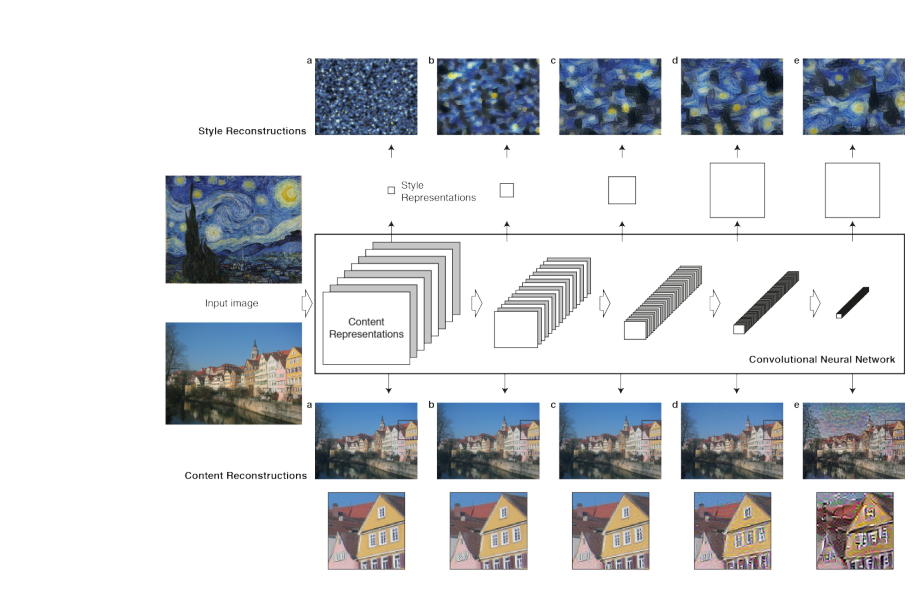
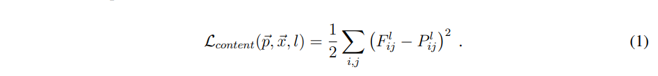
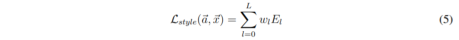
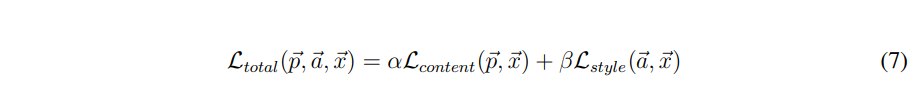
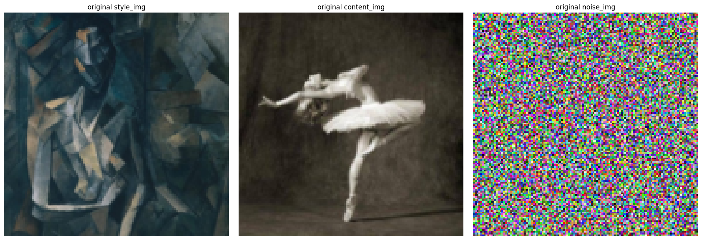
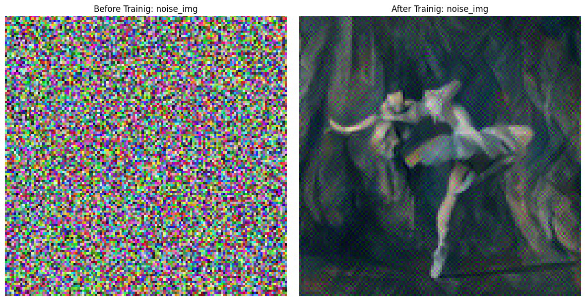
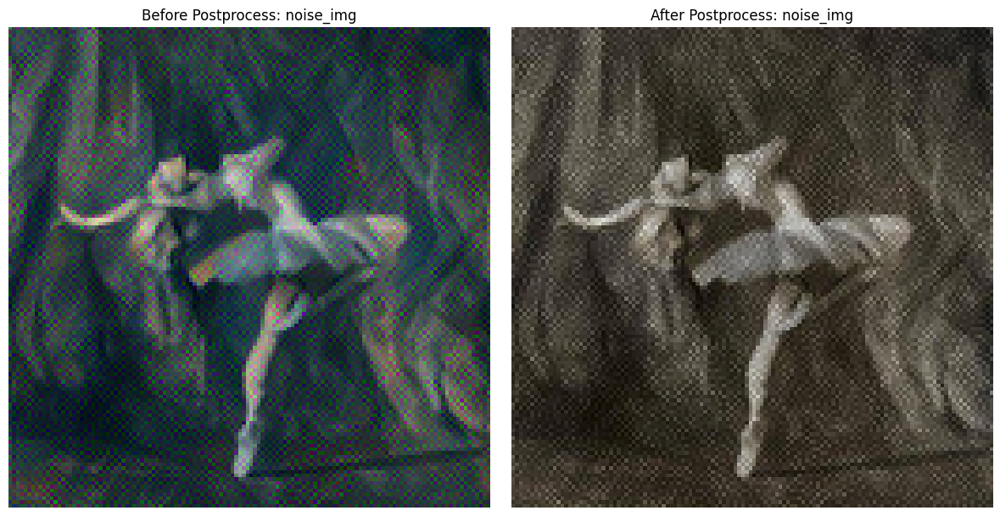

# Neural Transfer

This repository implements the paper **"[A Neural Algorithm of Artistic Style (2015)](https://arxiv.org/abs/1508.06576)"** by Gatys et al., which introduces a method for transferring artistic styles from one image to another using deep learning.

## Paper Summary
The paper proposes a neural algorithm that separates and recombines the **content** of one image and the **style** of another by optimizing a loss function based on deep convolutional neural networks.



### 1. **VGG19 Model Initialization**
- The pre-trained VGG19 model, trained on the ImageNet dataset, is used.
- Only the **first five convolution layers** are utilized, while the fully connected layers are discarded.
- The original **Max Pooling** layers are replaced with **Average Pooling** layers to enhance stability during style extraction.

### 2. **Content Loss Calculation**
- The **content image** is passed through the network, and the feature map is extracted from a specific layer (e.g., conv_4).
- A **noise image**, initialized with mean 0 and standard deviation 1, is also passed through the same layer to obtain its feature map.
- The difference between the two feature maps is calculated using the **Mean Squared Error (MSE)**, which defines the content loss.

### 3. **Style Loss Calculation**
- The **style image** is passed through the network to extract feature maps from all convolution layers.
- To capture the relationships between features, a **Gram Matrix** is computed for each layer:
  - The Gram Matrix represents the inner product of feature maps, encapsulating the style information.
- The noise image's feature maps are similarly processed to compute their Gram Matrices, which are then compared to those of the style image using MSE.
- The style loss is the weighted sum of the MSE values across all layers.

## 4. **Total Loss and Optimization**
- The **content loss** and **style loss** are combined to define the total loss:  
    
    
    
    - alpha: Weight for the content loss
    - beta: Weight for the style loss
- The noise image is optimized to minimize the total loss, resulting in the final output image.

## Installation
```
pip3 install requirements.txt
```

## Results




## References
- https://arxiv.org/pdf/1508.06576
- https://tutorials.pytorch.kr/advanced/neural_style_tutorial.html

## Todo List
- [ ] compare gram-matrix and cosine similarity